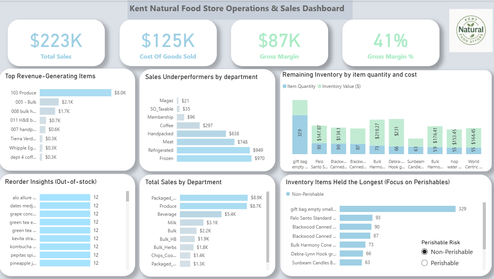

# Kent Natural Food Store Operations and Sales Dashboard

Power BI dashboard project for sales, inventory, reorder alerts, gross margin, and department-level performance at Kent Natural Food Store.

## Portfolio Summary

This project transforms raw sales, inventory, and cost data into an interactive decision-support dashboard. The dashboard is designed around operational questions for buyers and managers, including what to reorder, which departments drive sales, and where inventory is aging.

## Business Context

Kent Natural Food Store is a community-owned grocery co-op with multiple departments and buyers. Historical point-of-sale and inventory data had not been systematically analyzed, limiting visibility into sales patterns, stock risk, and profitability.

## Business Questions

The dashboard answers:

- Which items sell the most and least?
- Which departments drive the most sales?
- How much inventory is currently held by quantity and value?
- Which products are below reorder point?
- Which items have been in inventory the longest?
- What are total sales, cost of goods sold, and gross margin?

## Data Preparation

Key preparation steps included:

- Cleaning product, department, and category fields
- Resolving missing and inconsistent values
- Modeling relationships across sales, inventory, and cost tables
- Creating DAX measures for sales, COGS, gross margin, inventory value, aging, and reorder quantities

## Dashboard Features

- KPI cards for sales, COGS, and gross margin
- Top and bottom product analysis
- Department-level performance views
- Inventory quantity and value analysis
- Reorder alerts
- Inventory aging views with emphasis on perishables
- Interactive filters by department, category, and product

## Key Insights

- Produce and packaged dry goods were major sales drivers.
- Products below reorder point indicated stockout risk.
- Long-held inventory tied up capital and shelf space.
- Gross margin analysis provided a clearer view of store performance.

## Tools

Power BI, DAX, data modeling, dashboard design, business intelligence, inventory analytics.

## Portfolio Value

This project demonstrates dashboard design around real operational decisions, not just visual display. It connects raw data transformation, KPI logic, and actionable recommendations.

## Author

Sairam Jammu  
M.S. Business Analytics, Kent State University
